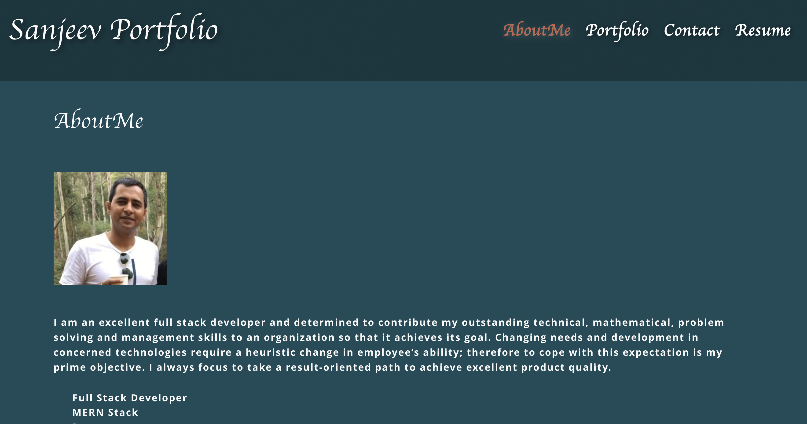
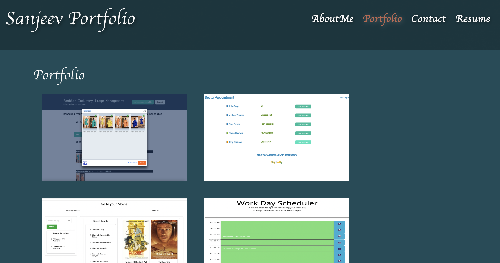
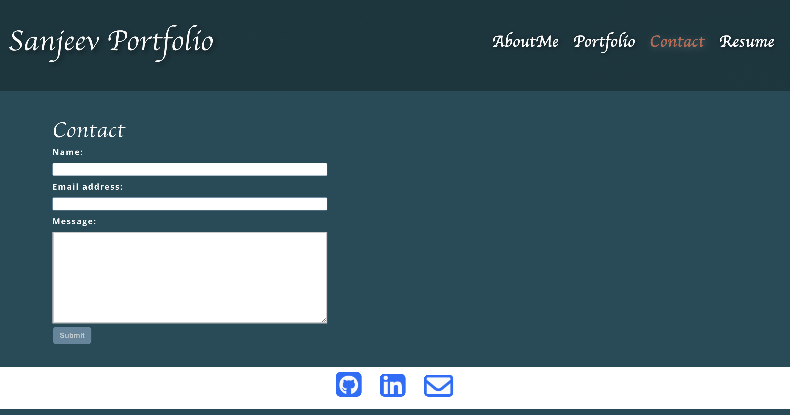
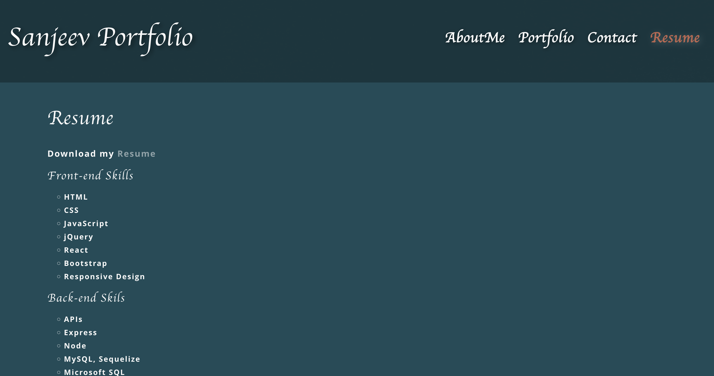

# README Generator

[Application URL](https://sanjeevkumar-dev.github.io/portfolio-react-sanjeev-app/)
[Repository URL ](https://github.com/SanjeevKumar-DEV/portfolio-react-sanjeev-app)

## Description

> My Work as developer as has been showcased
> Links to repo and application has been published
> My resume and short desc about me has been published
> My contact details through emails and phone number has been published
> My linkedIn profile and github profile links has been attached 

## Table of Contents

- [Installation](#Installation)
- [Usage](#Usage)
- [Contributing](#Contributing)
- [Tests](#Tests)
- [Questions](#Questions)
- [License](#License)

## Installation

## Usage

> Go to My Portfolio website.  
 
> Portfolio Page 
 
> Contact Page  

> Download Resume  
 

## Contributing

## Tests

> Not Applicable 

## Questions

> Q1. What is my link to my github profile ? 
Answer: [Github Username](https://github.com/SanjeevKumar-DEV) 

> Q2. How to reach me with additional questions ? 
Answer: [Contact Email](mailto:sanjeevkumar@me.com)

## License

> License agreement is covered under EULA with Github
